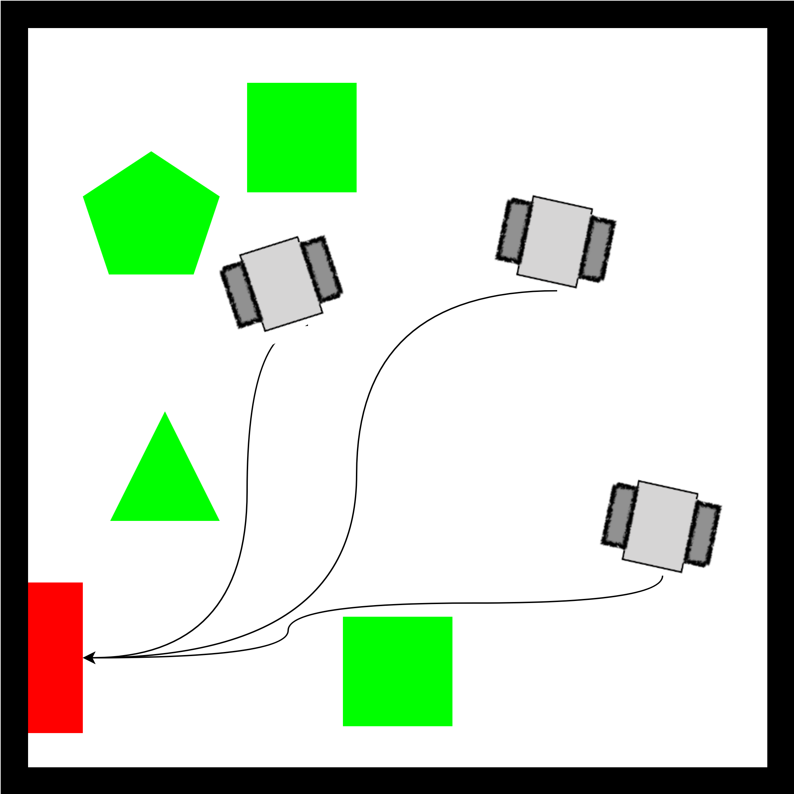
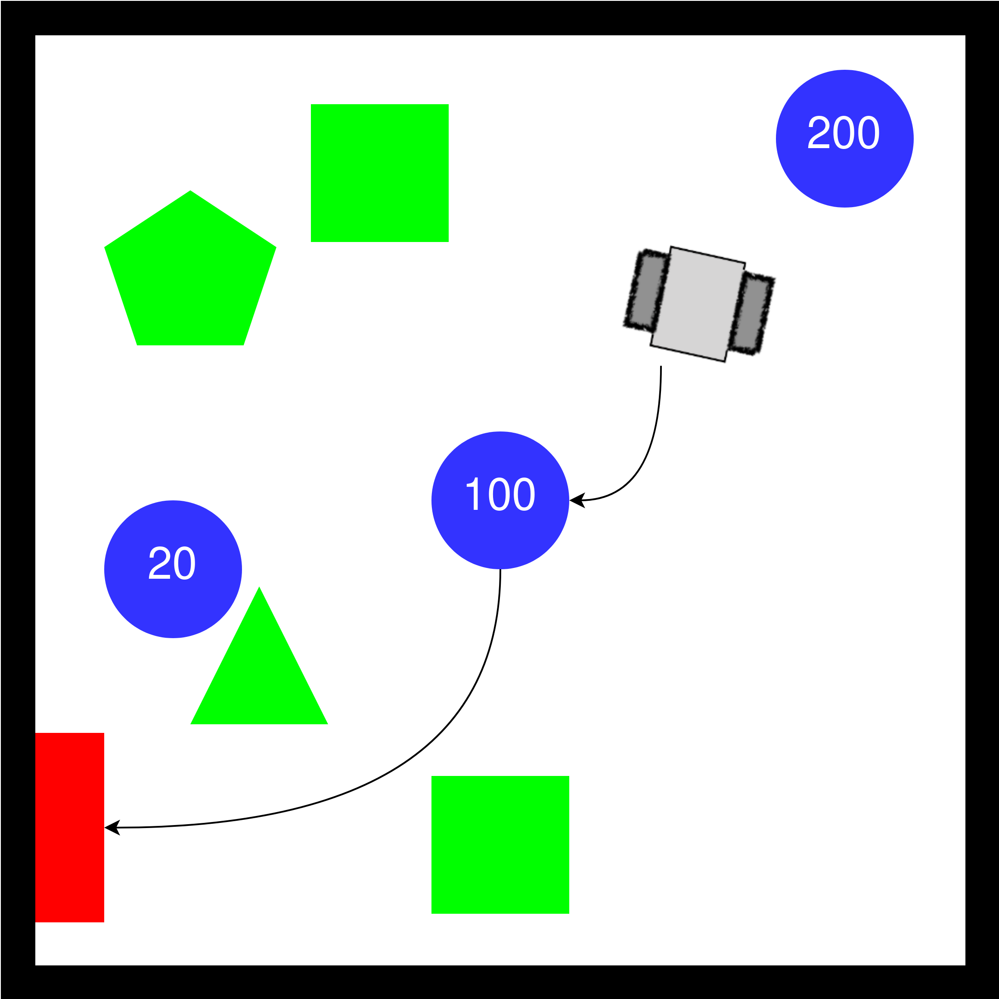

<p align='center'>
    <h1 align="center">Robot Planning and its Applications Project 2023/24</h1>
</p>

----------

- [General Description](#general-description)
  - [Coordinate Evacuation](#coordinate-evacuation)
    - [Evaluation](#evaluation)
    - [Assumptions](#assumptions)
    - [Steps](#steps)
    - [Suggestions](#suggestions)
  - [Target Rescue](#target-rescue)
    - [Evaluation](#evaluation-1)
    - [Assumptions](#assumptions-1)
  - [Pursuit-Evasion](#pursuit-evasion)
    - [Evaluation](#evaluation-2)
    - [Assumptions](#assumptions-2)
    - [Level of complexity](#level-of-complexity)
    - [Steps](#steps-1)
- [How to develop the project](#how-to-develop-the-project)
  - [Getting the simulation](#getting-the-simulation)
  - [The missing](#the-missing)
- [Delivery](#delivery)
  - [What you should provide](#what-you-should-provide)
  - [When you should provide the what](#when-you-should-provide-the-what)
  - [How you should provide the what](#how-you-should-provide-the-what)
- [Other useful information](#other-useful-information)
- [TODOs on my end](#todos-on-my-end)
- [P.S.](#ps)

# General Description

The project consists of different scenarios, which will challenge the students to apply the algorithms and the theoretical knowledge learned during lectures to practical cases. 

The project will focus on implementing algorithms for path planning and target planning. The students will have to design and implement one or more nodes of ROS2 in C++. 

Briefly the three projects are:

- Coordinated evacuation, which will challenge the multi-agent coordination;
- Target rescue, which will challenge the design of algorithms to maximize the revenue;
- Pursuit evader, which will challenge the design of algorithms scenarios that change dynamically.

Each group of students, composed at maximum of 3 students $\left(|\text{group}|\in[1,3]\right)$, will have to choose 1 of the 3 scenarios and develop a solution for it. If you want to implement more than one, feel free to do it. 

General assumptions are:

- The robots move at constant speed, i.e., use Dubins manoeuvres;
- Touching the borders of the map and/or the obstacle will decrease the point obtained by completely the task successfully.  
- The robots (except for the pursuer in the evasion scenario) must reach the center of the gate and with the angle provided in the topic.
- Obstacles may have different shapes, so do not assume they are polygons.

## Coordinate Evacuation

<center>

</center>

The project is about designing a coordinate evacuation of a site cluttered by several obstacles and robots. 

The robots will have to reach a gate in the minimum amount of time avoiding the obstacles _and_ avoiding collisions with other robots.

### Evaluation

You will gain points for minimizing:

- time to construct the roadmap, i.e., a graph of the map;
- time to plan for the solution of the problem;
- time to execute the task, as the time from the first movement of the first robot to the final movement of the final robot;

You will lose points for:

- robots exiting bounderies and/or touching obstacles;
- robots colliding between each other.


### Assumptions

- Robots are initially spawned at random position, i.e., get their position as a first thing. 
- Robots reaching the gate will disappear. 
- Since robots move at constant velocity, they _should_ not be able to stop.

### Steps

1. The students will have to create a roadmap that enables the robot to move in minimum time and with guaranteed clearance from the obstacles.

2. The roadmap will have to be decorated with information regarding the nodes and the links that cannot be occupied at the same time by two robots, lest a collision occurs.

3. The students will set up an automatic strategy (e.g., optimisation based, heuristic) to decide the motion of the robots so that they evacuate the area without creating collisions. Any algorithm for finding the strategy to move the agents from the given initial nodes towards the escape gate can be used.

### Suggestions

The student can make the hypothesis of a synchronous behaviour: i.e., the system evolves in a sequence of states and each state is characterised by having the robot located in one of the nodes of the roadmap. In this way, every step of the plan is ended when all robots have reached a location and no robot is allowed to move to the next location before a step completes. Alternatively, the students can also release this assumption and allow the robot to move freely (asynchronous behaviour).

## Target Rescue 

<center>

</center>

The project consists in rescuing some victims using a single robot. While the order in which the victims are rescued does not matter, they have to be rescued within a time limit. Each victim is associated with a value and the higher the total value of the rescued victims, the better it is. 

Failing to reach the goal means failing the task.

### Evaluation

You will gain points by:

- rescuing victims;
- minimizing the time it takes to construct the map, plan, and execute.

You will lose points for:

- touching the obstacles/borders
- not reaching the gate, which will give 0 points despite the rescued victims.

### Assumptions

- While victims are circles of radius 0.5m, the robot must pass though the center of the circle in order to rescue them. 
- The robot does not need to stop to rescue e victim.
- The robot and the victims are initially deployed in random positions.
- Since robots move at constant velocity, they _must not_ stop or slow down.

## Pursuit-Evasion

<center>

</center>

The project is about capturing an evader robot (evader) using a pursuer robot. Both the pursuer and the evader move in an environment characterised by the presence of obstacles.

The map can have one or more exit points and the project has different levels of difficulty, as detailed below.

The students will have to code the behaviour of both the pursuer and the evader.


### Evaluation

You will gain points for minimizing:

- time to construct the roadmap, i.e., a graph of the map;
- time to plan for the solution of the problem;
- time to execute the task, as the time from the first movement of the first robot to the time of catching the evader;

You will lose points for:

- robots exiting bounderies and/or touching obstacles;
- not catching the evader.

Also the points will be given based on the difficulty of the scenario: catching the evader in an easier scenario will give less points than catching it in a more difficult one.

### Assumptions

- The robots are initially deployed at random positions.
- The evader _is controller by the computer_ but it HAS to move following the same roadmap computed by the pursuer. The students will have to publish said roadmap on a topic so that it can be used by the evader algorithm to compute the path.
- You can assume that once the evader takes a link of the graph, it has to complete the movement and cannot back-off or stop.
- Since robots move at constant velocity, they _must_ not stop or slow down.
- The pursuer does not know the evader's future path, hence you cannot read from the evader topic to get the path it will follow. 
- Once the evader has chosen a gate to reach, it will follow the shortest path to the gate without considering other smarter policies to avoid the pursuer(s).

### Level of complexity

The behaviour of the evader is organised in increasing levels of complexity:

1. There is only one exit and the evader has to reach it in minimum time.
   
2. There are two exits and at each location of the roadmap reached by the evader, it can decide non-deterministically to go in minimum time to one or to the other.
   
3. There are two exits and at each location of the roadmap the evader can decide to take one or the other accounting for the presence of the pursuer.

4. Given a not smart behaviour of the evader as in point 2, there are multiple pursuer that can be used to catch the evader. Pursuers must coordinate, i.e., they must not collide otherwise the group will lose points.

### Steps

The students will setup a strategy (e.g., optimisation-based, heuristic) to decide the motion of the pursuer so that it reaches evader in minimum time. The strategy can achieve different goals depending on the level of behavioural complexity considered for the evader. The minimum requirement is to fulfill the first level of complexity.


# How to develop the project

## Getting the simulation 

The code for the simulation is available at: [https://github.com/pla10/Shelfino_ROS2/](https://github.com/pla10/Shelfino_ROS2/). The simulation uses an external library to check for collisions of the obstacles, so once you downloaded it, make sure to enter in the main folder and run 

```bash
git submodule update --init --recursive
```

This should populate the repository `map_pkg/include/geometry`.

To create the workspace, clone the repository and its submodules, you should run:

```bash
mkdir shelfino_ws
cd shelfino_ws 
git clone https://github.com/pla10/Shelfino_ROS2/ src --recurse-submodules
```

The structure of the code is the following: 

- `assets`: contains images used in the READMEs.

- `graph_msgs`: contains the interface of the `graph_msgs` to be used to publish the roadmap.
 
- `map_pkg`: contains 
  - spawning random obstacles;
  - spawning random victims;
  - spawning random gates, only along the borders of the map;
  - spawning the borders;
  
  This package publishes the following topics:
  - `/obstacles`: contains the obstacles that are present on the map. They may be only cylinders or boxes. In the former, the center $(x, y)$ in $z=0$ and the radius are provided, in the latter, the center $(x,y)$ in $z=0$ and the lengths of the borders are provided. 
  - `/map_borders`: 
  - `/victims`: contains information for the victims, which are thought as circles of radius 0.5m.
  - `/gate_position`: contains the position and orientation of the gate.
  
  This package can be configured using the `map_config.yaml` file inside of `map_pkg/config`. Also check the launch file to have more information on the possible parameters to pass. 

- `obstacles_msgs`: contains the interfaces used to publish the obstacles and the victims.

- `projects`: contains 3 launch file that automatically start the simulation:
  - `evacuation.launch.py`
  - `evader.launch.py`
  - `victims.launch.py`

  Check the launch files for more information.

- `shelfino_description`: it contains the launch file for starting the robot state publisher and the models to be used both in Rviz and in Gazebo. 
  
- `shelfino_gazebo`: it contains the launch file to start the simulation in Gazebo. It also contains some pre-defined worlds.
  
- `shelfino_navigation`: it contains the launch file and the parameters to start the Nav2 environment for the Shelfino.

You are free to change the parameters in every of the nodes, but you should carefully explain why you chose to and what benefit it provided. 

Remember that each Shelfino will have its own namespace so the topics that are dependent on the Shelfino, for example the topic `/initialpose`, which provide the initial position of a Shelfino, will be remapped to `/shelfino#/initialpose`, where # is the number of the Shelfino.

## The missing

So what is missing? The course is called Robot Planing and its Applications, so all the planning part is missing. 

You should write C++ (standard 17) nodes that allow the robots to complete their tasks. To do so:

- Build the roadmap by reading the borders from `/map_borders` and the obstacles from `/obstacles`. If you are doing the pursuer-evader project, you *must* also publish the graph that you obtained using the messages available in graph_msgs. 
- Create a node that is used for path planning using Dubins.
- Once you have the roadmap and a path planner, you should compute the best path for the robots to complete their tasks. Once that's done, split each path and 
  - publish them on the topic `/shelfino#/plan1`, and
  - create an action request to FollowPath\* of Nav2 passing the points you have computed from the split. Also you should monitor the action server.
- [Optional] Monitor the movements and avoid collisions between robots, obstacles and/or borders.

\* At the moment Nav2 is configured to use FollowPath. If you prefer to use something different please feel free to do as you prefer, but you must specify this in the report and why. Another possibility is to directly compute the velocities that the robot should follow and pass them directly to `/shelfino#/cmd_vel`.

# Delivery

## What you should provide

- A PDF report describing the approach followed, the reason why you decided to follow said approach and the difficulties encountered. You should also, but it's not mandatory, include possible results that you have obtained, for example, statistics on the times it takes to compute a solution and/or the length of the solutions it finds. Any information that you think may be interesting regarding the project should be included.
- An archive containing all the software to allow reproducing the approach written in the report. 

## When you should provide the what

You should deliver the report and the code at least **1 week** before the date of the exam. Exam dates will be released in the near future and this document will be updated with them.

| Date of exam | Delivery date          |
|--------------|------------------------|
| 12/01/2024   | 11/01/2024 12:00 (CET) |
| 16/02/2024   | 14/02/2024 23:59 (CET) |
| TBD          | One week before        |

## How you should provide the what 

As said, [this](https://github.com/pla10/Shelfino_ROS2/) is the repository containing the code of the simulation and that is updated to fix bug and/or to add new features. 

The best thing would be for each group to create a fork of the repository so that [you can pull changes](https://stackoverflow.com/questions/7244321/how-do-i-update-or-sync-a-forked-repository-on-github) from the main repo if new fixes or features are added. 

In any case, for the delivery you will have to provide an archive containing the code. Obviously no pre-compiled files nor executable will be taken into consideration.

You should send the archive and the pdf to me as an email and wait for my ACK on the reception of the email. Also, in the email you should state the group components, and a name for the group (if you have chosen one). 

# Other useful information

- You can use any C++ standard from C++14 and above. Mind though that the last standard for which ROS2 has complete support is C++17, while for above stanrdard there may be problems when compiling.
- AFAIC, using Nav2 FollowPath is the best course of actions. In this case, you should create your path using Dubins, split it in segments with the same lengths and then make a request to the Nav2 FollowPat action server to follow the points that you passed. The only part of this that is implemented is the Nav2 FollowPath server, but both the Dubins planner and the action client must be coded by you. 

# TODOs on my end

- As you may see by looking at the repository, the evader package is still empty. It will be updated during the week. 
- Some files are still missing their documentation. I'll see to udpate them as soon as I can .
- I'm aware that some of you have asked me to create a server for running Gazebo remotely, but it's not a simple task. Just know that I'll look into this as soon as I have the means.
- Fixing the robots. I hoped it would have taken less time, but at this point I hope to be able to fix them for end of December so that you can test your code on them by January. I'll keep you updated.

# P.S. 

Be warned that the code and the report will be run for plagiarism, and if found to be plagiarised you will face the legal and ethical consequences of such.